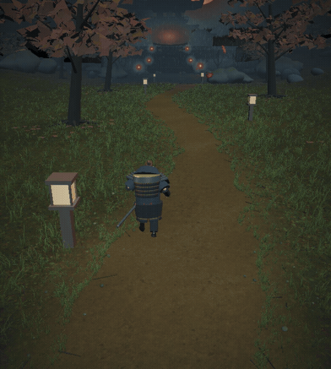

# Shumon · 朱門

**A five-minute samurai game in your browser.** Follow a lantern-lit woodland path, hold the temple gate through three encounters, and step inside to challenge the master.

### [▶ Play now — shumon.xyz](https://shumon.xyz)

Desktop · keyboard and mouse · no installation · built with Three.js, React, and Rapier.

[](https://github.com/srikarsunchu/Shumon/raw/refs/heads/master/docs/media/shumon-gameplay.mp4)

*Actual canvas recording. [Watch / download the 20-second gameplay video](https://github.com/srikarsunchu/Shumon/raw/refs/heads/master/docs/media/shumon-gameplay.mp4) · [Play in your browser](https://shumon.xyz).*

[Run locally](#run-locally) · [Controls](#controls) · [How it works](#how-it-works) · [Asset credits](#asset-credits) · [License](#license)

**License:** original work © 2026 Srikar Sunchu, all rights reserved. This is a public source repository, not an open-source release. Third-party assets retain their own licenses; see [LICENSE](LICENSE) and the [credits](#asset-credits).

If you enjoy the game or find the implementation interesting, a GitHub star helps people discover it.

## Run locally

Use Node.js 22 LTS and npm. Assets and fonts are bundled in the repository; no API keys or external services are required to run the game locally.

```bash
git clone https://github.com/srikarsunchu/Shumon.git
cd Shumon
npm ci
npm run dev
```

Open the local URL printed by Vite, usually `http://localhost:5173`.

```bash
npm test          # gameplay, combat, animation clips, and character checks
npm run build     # TypeScript check and production build into dist/
npm run preview   # serve the production build locally
```

Local setup instructions do not grant redistribution or commercial reuse rights. See [LICENSE](LICENSE).

## Controls

| Input | Action |
|---|---|
| Any key at the title | Begin |
| W A S D / arrow keys | Move |
| Shift | Run |
| Right mouse drag | Look around |
| Left click / Space | Sword strike |
| Hold and release Space during a standoff | Time the opening cut |
| F | Hold to guard; press at the right moment to parry |
| Q | Dodge |
| E | Draw / sheathe the sword |
| 1 / 2 / 3 / 4 | Stone / Water / Wind / Moon stance |
| R | Take the displayed sword when prompted |
| M | Toggle sound |
| Escape | Pause during play |
| Enter on an end card | Continue / play again, as shown |

## How it works

### The world

The environment combines procedural geometry with scanned ground textures. The original temple scene lives in [`templeNightRenderer.js`](src/shaders/temple-night/templeNightRenderer.js); the woodland approach and palace are separate modules.

- **Ground:** [`templeGround.js`](src/shaders/temple-night/templeGround.js) blends forest-floor and dirt color, normal, and surface maps on one terrain material. A winding path mask has noisy, feathered edges; larger-scale variation and offset texture sampling reduce obvious repetition. Surface maps contribute occlusion and roughness, with damp patches along the path.
- **Grass:** curved, tapered mesh ribbons form individual tufts. [`templeLandscape.js`](src/shaders/temple-night/templeLandscape.js) instances the tufts in patches, animates wind and player interaction, and reduces density with distance. The blades use geometry rather than transparent grass cards.
- **Atmosphere:** lantern light, rain, fog, drifting leaves, and post-processing tie the scene together. Adaptive resolution and distance-based detail help manage rendering cost.
- **Movement:** Rapier handles collision; mesh queries supply foot placement and camera clearance. [`templePalace.js`](src/shaders/temple-night/templePalace.js) adds the doors and explorable interior.

### The combat

[`templeGameplay.js`](src/shaders/temple-night/templeGameplay.js) owns the encounter and story state, player actions, timed hit windows, guarding, dodging, and standoffs. [`templeEnemies.js`](src/shaders/temple-night/templeEnemies.js) defines enemy behavior and stats; [`templeWeapons.js`](src/shaders/temple-night/templeWeapons.js) builds their equipment and layers distinct attack motions onto the animation rig.

| Stance | Strong against |
|---|---|
| Stone · 石 | Swordsman |
| Water · 水 | Shieldman |
| Wind · 風 | Spearman |
| Moon · 月 | Brute |

Matching an enemy's counter stance applies **1.6× damage and stagger**. Water also bypasses the shieldman's chance to block other stances. Attacks only connect within their active timing window, reach, and facing cone, with at most one hit per enemy per swing. A well-timed parry creates an opening; vulnerable enemies take additional damage.

The three courtyard encounters introduce a swordsman, shield-and-spear opponents, then a brute with a swordsman. Clearing them opens the palace chapter and a final duel. The master changes forms: match his current stance to counter him.

Character movement uses retargeted Quaternius animations plus procedural drawing, sheathing, stance layers, and foot correction. Optional authored pose clips are included for experimentation but are not enabled by default. Audio is synthesized in the browser.

### Where to start reading

| File | Responsibility |
|---|---|
| [`TempleNightScene.tsx`](src/shaders/temple-night/TempleNightScene.tsx) | React host, loading flow, overlays, and lifecycle |
| [`copy.ts`](src/shaders/temple-night/copy.ts) | Player-facing text and control labels |
| [`templeGameplay.js`](src/shaders/temple-night/templeGameplay.js) | Run state, combat, and story progression |
| [`templeGround.js`](src/shaders/temple-night/templeGround.js) | Soil material and grass geometry |
| [`templeLandscape.js`](src/shaders/temple-night/templeLandscape.js) | Woodland layout, instancing, and wind |
| [`templePalace.js`](src/shaders/temple-night/templePalace.js) | Palace architecture and doors |
| [`tests/`](tests/) | Behavior and asset checks |

The renderer retains its generated-scene structure; prefer the surrounding modules for focused changes. Three.js is pinned to r149, which uses texture `.encoding` rather than the newer `.colorSpace` API.

## Asset credits

| Asset | Source / license |
|---|---|
| Forest Floor and Dirt Floor texture maps | eye-candy.xyz / Poly Haven · CC0; [source URLs and checksums](public/assets/ground/sources.json) |
| Universal Animation Library (Standard) | Quaternius · [CC0 license](public/assets/quaternius/LICENSE.txt) |
| Samurai base mesh, skin, eyes, and facial assets | MakeHuman / MPFB data and system assets · CC0; [detailed provenance](public/assets/samurai/CREDITS.md) |
| Cormorant Garamond | [SIL Open Font License](public/fonts/OFL-CormorantGaramond.txt) |
| Jost | [SIL Open Font License](public/fonts/OFL-Jost.txt) |
| Noto Serif JP | [SIL Open Font License](public/fonts/OFL-NotoSerifJP.txt) |
| Procedural environment, armor, effects, and synthesized audio | Original project work; all rights reserved |

See [asset credits](public/assets/CREDITS.md) for creator links and animation provenance. Blender and MPFB are asset-generation tools; their code is not shipped in the browser game. Dependencies retain their respective licenses. No Ghost of Tsushima assets or extracted game data are included.

## License

**Copyright © 2026 Srikar Sunchu. All rights reserved.**

No general license to copy, modify, redistribute, sublicense, or commercially reuse the original project work is granted. Third-party components remain subject to their own licenses. See [LICENSE](LICENSE) for scope.
